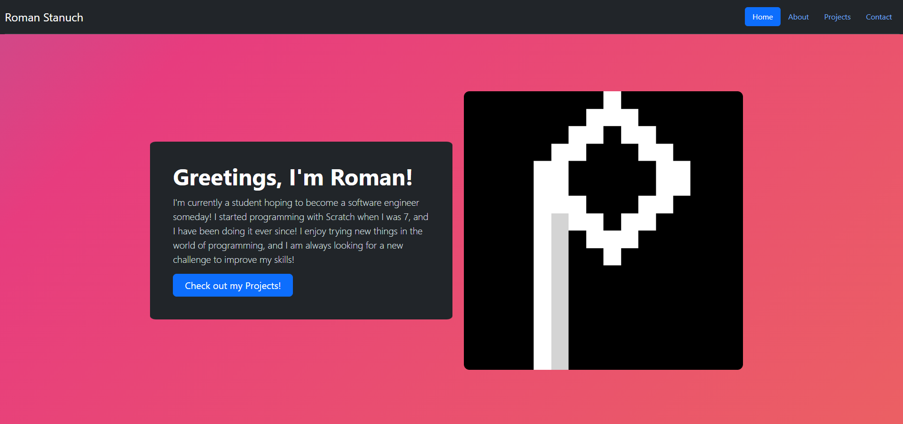

## Portfolio Site

 

  

 

This is a simple portfolio site I created using HTML, CSS, and Bootstrap. I also learned how to use GitHub pages in order to publish it for others to see. It is my first attempt at a professional website, and I hope to update it as my skills improve!
